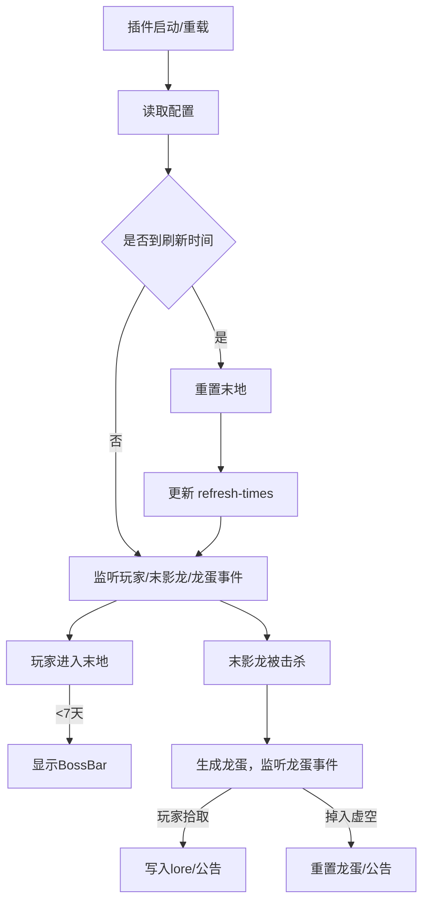

# ZthTerminal3EndAutoRenew

## 主要功能

- 支持通过配置文件指定多个未来的末地刷新指定时间点，并自动管理定时刷新流程
- 刷新时间到期，自动、安全稳定地重置原版末地世界
- 刷新前 7 天，玩家进入末地会看到 BOSS Bar 实时剩余倒计时
- 末影龙被击杀后，自动监听龙蛋拾取并公告，无 Lore 的龙蛋将会在玩家拾取后自动根据自定义模板动态生成（含玩家名/日期）
- 若龙蛋落入虚空，则倒计时一分钟后自动刷回末地主传送门并公告
- 全消息采用 MiniMessage 格式，配置灵活

---

## 配置文件结构示例（`config.yml`）

```yaml
# 时区，影响所有日期解析和倒计时显示
timezone: Asia/Shanghai

# 刷新时间点，支持灵活规划，格式必须为 yyyy-MM-dd HH:mm:ss
refresh-times:
  - '2025-06-07 20:00:00'
  - '2025-07-05 20:00:00'
  - '2025-08-02 20:00:00'

# BossBar 提示内容，{time} 会替换为秒级剩余时间人类化字符串
bossbar-message: "<gradient:#ce9ffc:#7367f0>距离末地重置还有 {time}</gradient>"

# 龙蛋 lore 模板，支持 {player}（玩家名）、{date}（归属日期）变量
dragon-egg-lore:
  - "<i:false><white>{player}达成了目标<green>[下一世代]</green></white></i>"
  - "<i:false><dark_gray><{date}></dark_gray></i>"

# 公告相关模板
announce-winner: "恭喜 <aqua>{player}</aqua> 拾取了龙蛋!"
announce-egg-reset: "<red>悲报:</red> 龙蛋落入虚空，将在 1 分钟后重置到传送门上方!"
egg-reset-bossbar-title: "<gradient:#ce9ffc:#7367f0>龙蛋将在 <white>{time}</white> 秒后再次刷新</gradient>"
```

- 插件每次启动和刷新后会自动移除小于当前时间的条目，仅保留未来的刷新点
- 如需调整计划，直接编辑 `refresh-times` 即可

---

## 主流程框架



---

## 主要类与职责

| 类/模块                        | 职责                                                                 |
|-------------------------------|--------------------------------------------------------------------|
| ZthTerminal3EndAutoRenew（JavaPlugin） | 插件主入口，注册监听器、命令、加载/保存配置                          |
| ConfigManager                 | 负责读写 YAML 配置、热重载、变量替换                                 |
| EndResetScheduler             | 定时调度与刷新事件管理，确保刷新的准确与安全                         |
| BossBarManager                | 管理玩家 BossBar 显示与动态倒计时                                    |
| DragonEggListener             | 监听末影龙死亡、龙蛋生成/归属/掉落处理                               |
| PluginCommands                | 负责 /zthautorenew 相关命令注册与处理，支持刷新计划的管理与热重载      |

---

## 命令说明

- 所有命令前缀均为 `/zthautorenew`，需相应权限。
- 支持 Tab 补全与参数提示。

| 命令格式                                      | 权限节点                              | 功能说明                   |
|-----------------------------------------------|--------------------------------------|----------------------------|
| /zthautorenew reload                          | zthterminal3endautorenew.reload      | 重载插件配置               |
| /zthautorenew list                            | zthterminal3endautorenew.manage      | 列出所有已配置刷新时间     |
| /zthautorenew add <yyyy-MM-dd HH:mm:ss>       | zthterminal3endautorenew.manage      | 添加一个新的刷新时间点     |
| /zthautorenew remove <yyyy-MM-dd HH:mm:ss>    | zthterminal3endautorenew.manage      | 移除指定的刷新时间点       |

- 示例：`/zthautorenew add 2025-12-31 20:00:00`
- 时间参数需严格遵循 `yyyy-MM-dd HH:mm:ss` 格式，且必须为未来时间。

---

## 主要事件与数据流

- 插件启动/重载：加载 config，分析 refresh-times，只保留未来时间
- 定时线程/任务调度，定期检查是否到时间点，到点后优先尝试安全卸载并重建末地（极端情况下重启服务端）
- 玩家进入末地，若距离下次刷新不足 7 天，BossBar 显示剩余倒计时
- EntityDeathEvent/ItemSpawnEvent/PlayerInteractEvent 检测龙蛋归属与流向，自动修改 Lore、公告
- 龙蛋掉入虚空时广播并自动复原龙蛋至主传送门
- 支持命令（/zthautorenew reload, list, add, remove）灵活管理与查阅刷新计划、热重载配置

---

## 配置注意事项

- refresh-times 必须为未来时间且格式统一
- timezone 支持所有 IANA 标准时区
- 变量替换说明：  
  - `{player}`：玩家名  
  - `{date}`：归属时间（格式与 config 保持一致）
  - `{time}`：BossBar 剩余时间

---

## 变更与扩展建议

- 刷新周期变更请直接编辑 config 并重载插件
- 时间点支持随时插入/删除/调整，适配真实活动变动
- 业务流程稳定后支持事件钩子及更多自定义需求扩展

---

### 开发/结构说明

- 主源码位于 `src/main/java/ink/magma/zthTerminal3EndAutoRenew/`，各核心类文件与职责如上表。
- 插件主类为 `ZthTerminal3EndAutoRenew.java`，命令处理集中于 `PluginCommands.java`。
- 配置文件位于 `src/main/resources/config.yml`，如需自定义请参考上文示例。

本设计可直接用于代码开发阶段。如有补充请于此文档下备注。