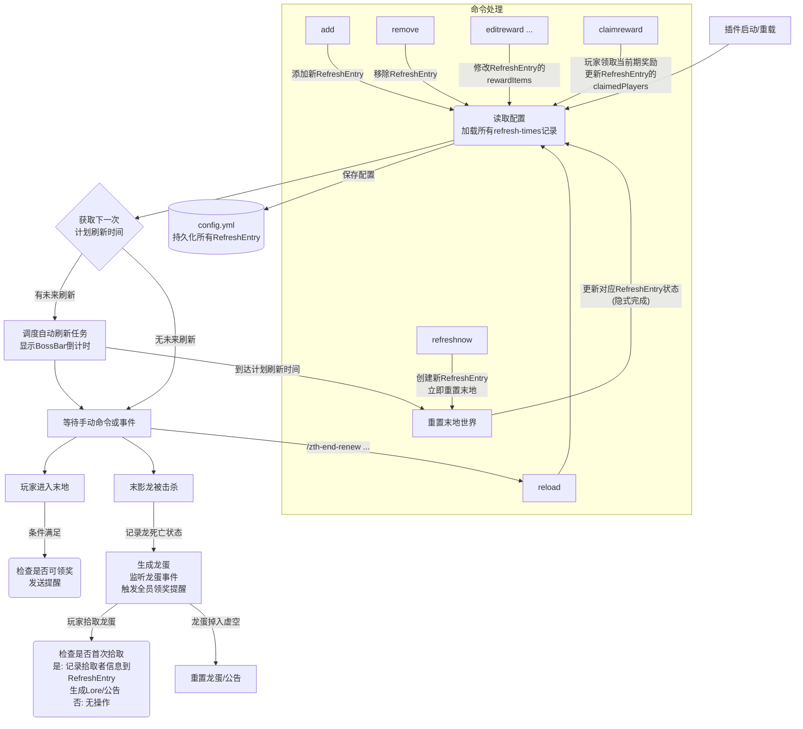

# ZthTerminal3EndAutoRenew

## 主要功能

- **定时与手动末地刷新**: 支持通过配置文件指定多个未来的末地刷新时间点，并提供管理员命令手动触发即时刷新。
- **详细刷新记录**:
  - 每次刷新（无论是计划的还是手动的）都会在配置文件中生成一条详细记录。
  - 记录内容包括：刷新时间、**龙蛋拾取者信息** (UUID, 名称, 拾取时间)、**每期自定义奖励物品列表** (`ItemStack` 形式)、以及**已领取该期奖励的玩家列表**。
  - 所有历史刷新记录及其详细信息都会被持久化保存。
- **安全重置**: 刷新时自动、安全稳定地重置原版末地世界。
- **BossBar 倒计时**: 刷新前特定天数（可配置，默认为 7 天），玩家进入末地会看到 Boss Bar 显示的实时剩余倒计时。
- **龙蛋事件处理**:
  - 末影龙被击杀后，自动监听龙蛋拾取。
  - 首次拾取龙蛋时，记录拾取者信息到对应的刷新记录中，并根据自定义模板动态生成 Lore（含玩家名/日期）、公告获胜者。
  - 防止同一刷新周期内重复记录龙蛋拾取者。
  - 若龙蛋落入虚空，则倒计时一分钟后自动刷回末地主传送门并公告。
- **全员奖励系统**:
  - 管理员可通过命令为每次刷新事件配置不同的奖励物品 (`ItemStack` 列表)。
  - 玩家可通过命令 `/zth-end-renew claimreward` 领取“当前期”（最近一次末影龙已被击败的刷新周期）的奖励。
  - 玩家对同一刷新周期的奖励只能领取一次。
  - **奖励提醒**: 当末影龙被击败后，或玩家进入末地（且龙已被击败）时，若玩家尚未领取当前期奖励，会收到可点击的领取提示。
- **灵活配置与管理**:
  - 所有消息和大部分文本均支持 MiniMessage 格式。
  * 提供丰富的管理员命令，用于管理刷新计划、编辑每期奖励、手动刷新等。
- **Adventure API**: 插件消息和交互组件采用 Adventure API，提供更好的用户体验。

---

## 配置文件结构示例（`config.yml`）

```yaml
# 时区，影响所有日期解析和倒计时显示
timezone: Asia/Shanghai

# 刷新时间记录列表
# 每个条目都是一次末地刷新的详细记录，包括历史和未来的刷新
refresh-times:
  - time: "2025-06-07 20:00:00" # 本次刷新的准确时间点
    dragon-egg-owner: # 龙蛋拾取者信息
      uuid: "" # 拾取者UUID (为空表示尚未被拾取或记录)
      name: "" # 拾取者名称
      pickup-time: "" # 龙蛋被拾取的时间 (yyyy-MM-dd HH:mm:ss)
    reward-claimed-players: [] # 已领取本期奖励的玩家UUID列表
    reward-items: # 本期刷新的奖励物品列表 (序列化的ItemStack)
      - ==: org.bukkit.inventory.ItemStack # Bukkit序列化标记
        v: 3700 # ItemStack 版本号 (示例)
        type: DIAMOND
        amount: 5
      - ==: org.bukkit.inventory.ItemStack
        v: 3700
        type: GOLDEN_APPLE
        meta:
          ==: ItemMeta
          meta-type: UNSPECIFIC
          display-name: '{"text":"超级苹果","color":"gold"}'
          enchants:
            PROTECTION_ENVIRONMENTAL: 1
  - time: "2025-07-05 20:00:00"
    dragon-egg-owner:
      uuid: ""
      name: ""
      pickup-time: ""
    reward-claimed-players: []
    reward-items: [] # 这期可以没有预设奖励
  # ... 更多刷新记录 ...

# BossBar 提示内容，{time} 会替换为到下一次计划刷新的剩余时间
bossbar-message: "<gradient:#ce9ffc:#7367f0>距离下次末地重置还有 {time}</gradient>"

# 龙蛋 lore 模板，支持 {player}（玩家名）、{date}（归属日期）变量
dragon-egg-lore:
  - "<i:false><white>{player}达成了目标<green>[下一世代]</green></white></i>"
  - "<i:false><dark_gray><{date}></dark_gray></i>"

# 公告相关模板
announce-winner: "恭喜 <aqua>{player}</aqua> 拾取了龙蛋!"
announce-egg-reset: "<red>悲报:</red> 龙蛋落入虚空，将在 1 分钟后重置到传送门上方!"
egg-reset-bossbar-title: "<gradient:#ce9ffc:#7367f0>龙蛋将在 <white>{time}</white> 秒后再次刷新</gradient>"
end-reset-broadcast-message: "<#FF00FF>[末地刷新] <#FFC0CB>末地已重置，新的冒险开始了!" # 末地重置完成时的广播
# broadcast-end-reset: true # 是否启用末地重置完成的广播，默认为 true (此项在ConfigManager中，但不在默认config.yml中，按需添加)
```

- 插件会加载并保留所有 `refresh-times` 中的记录，包括过去的和未来的。
- 管理员可以通过命令动态添加新的计划刷新时间点，或手动触发即时刷新（也会生成记录）。

---

## 主流程框架



---

## 主要类与职责

| 类/模块                                | 职责                                                                                                                                    |
| -------------------------------------- | --------------------------------------------------------------------------------------------------------------------------------------- |
| ZthTerminal3EndAutoRenew（JavaPlugin） | 插件主入口，注册监听器、命令、初始化核心管理器。                                                                                        |
| ConfigManager                          | 负责读写 `config.yml`，特别是 `refresh-times` 列表的序列化/反序列化 (含 `RefreshEntry`, `DragonEggOwner`, `ItemStack` 列表)，管理时区。 |
| EndResetScheduler                      | 定时调度自动刷新任务，执行末地世界重置，管理 BossBar 倒计时逻辑。                                                                       |
| BossBarManager                         | 实际创建、更新和移除玩家 BossBar 的具体实现。                                                                                           |
| DragonEggListener                      | 监听末影龙死亡、龙蛋交互/拾取、龙蛋掉落虚空等事件，并据此更新 `RefreshEntry` 中的龙蛋得主信息、触发奖励提醒。                           |
| PluginCommands                         | 负责 `/zth-end-renew` 相关所有子命令的注册、参数解析、权限检查和逻辑处理，包括刷新计划管理、奖励编辑、手动刷新、玩家领奖等。            |
| PlayerRewardNotifierListener (或类似)  | (如果独立实现) 监听玩家进入末地、加入游戏事件，结合末影龙存活状态，触发奖励领取提醒。 (如果合并在其他监听器，则该职责分散)              |

---

## 命令说明

- 所有命令前缀均为 `/zth-end-renew`，需相应权限。
- 支持 Tab 补全与参数提示。
- 时间戳参数格式统一为 `yyyy-MM-dd HH:mm:ss`。

| 命令格式                                           | 权限节点                          | 功能说明                                                                  |
| -------------------------------------------------- | --------------------------------- | ------------------------------------------------------------------------- |
| `/zth-end-renew reload`                            | `zth.endrenew.reload`             | 重载插件配置和刷新计划。                                                  |
| `/zth-end-renew list`                              | `zth.endrenew.manage`             | 列出所有已配置的未来刷新时间点。                                          |
| `/zth-end-renew add <时间戳>`                      | `zth.endrenew.manage`             | 添加一个新的计划刷新时间点。                                              |
| `/zth-end-renew remove <时间戳>`                   | `zth.endrenew.manage`             | 移除一个已配置的计划刷新时间点。                                          |
| `/zth-end-renew refreshnow`                        | `zth.endrenew.admin.refreshnow`   | **新功能**: 立即手动触发一次末地刷新，并为此刷新创建一条新的记录。        |
| `/zth-end-renew editreward <时间戳> list`          | `zth.endrenew.admin.editreward`   | **新功能**: 列出指定刷新记录的当前奖励物品 (物品名旁有可点击的移除按钮)。 |
| `/zth-end-renew editreward <时间戳> add`           | `zth.endrenew.admin.editreward`   | **新功能**: 将管理员主手手持的物品添加到指定刷新记录的奖励列表中。        |
| `/zth-end-renew editreward <时间戳> remove <索引>` | `zth.endrenew.admin.editreward`   | **新功能**: 从指定刷新记录的奖励列表中移除指定索引的物品。                |
| `/zth-end-renew claimreward`                       | `zth.endrenew.player.claimreward` | **新功能**: 玩家领取“当前期”（最近一次末影龙已被击败的刷新）的奖励。      |

- **时间戳参数**: 对于 `add`, `remove`, `editreward` 命令中的 `<时间戳>`，它用于指定一个计划中的刷新。对于 `editreward`，它也可以指向一个过去的刷新记录，以编辑其奖励内容。
- **索引参数**: 对于 `editreward ... remove <索引>`，索引从 0 开始。
- 示例：
  - `/zth-end-renew add 2025-12-31 20:00:00`
  - `/zth-end-renew editreward "2025-06-07 20:00:00" list` (注意如果时间戳包含空格，可能需要引号)
  - (手持钻石) `/zth-end-renew editreward "2025-06-07 20:00:00" add`

---

## 主要事件与数据流

- **插件启动/重载**:
  - 加载 `config.yml`，完整解析 `refresh-times` 列表中的所有记录（包括历史和未来）到内存中的 `List<RefreshEntry>`。
  - 根据未来的 `RefreshEntry` 调度自动刷新任务和 BossBar 倒计时。
- **定时刷新**:
  - 到达计划的刷新时间点，执行末地重置。对应的 `RefreshEntry` 记录了此次事件。
- **手动刷新 (`/refreshnow`)**:
  - 管理员执行命令，立即重置末地。
  - 系统为此手动刷新创建一个新的 `RefreshEntry`（包含当前时间、空奖励、空拾取者等），并保存到配置中。
- **龙蛋事件 (`DragonEggListener`)**:
  - **末影龙死亡**:
    - 触发向末地在线玩家发送可领奖提醒（如果满足条件：当前期有奖励、玩家未领取、末地无其他龙）。
  - **龙蛋拾取**:
    - 确定“当前期” `RefreshEntry`。
    - 如果该 `RefreshEntry` 的 `dragonEggOwner` 尚无记录，则记录拾取者信息（UUID、名称、时间），更新 Lore，公告，并保存配置。
    - 如果已有记录，则不重复操作。
  - **龙蛋掉入虚空**: 广播并自动复原龙蛋。
- **奖励系统**:
  - **编辑奖励 (`/editreward`)**: 管理员为特定的 `RefreshEntry`（通过时间戳定位，可以是历史或未来的）添加、移除或列出奖励物品 (`ItemStack` 列表)。更改会保存到配置。
  - **领取奖励 (`/claimreward`)**: 玩家执行命令，系统确定“当前期”可领取的 `RefreshEntry`，检查资格（未领取、有奖励物品、龙已击败），发放奖励，并将玩家 UUID 记录到该 `RefreshEntry` 的 `rewardClaimedPlayers` 列表，保存配置。
  - **奖励提醒 (事件驱动)**:
    - 玩家进入末地 / 玩家加入游戏（在末地） / 末影龙死亡时，检查是否符合条件（末地无龙、当前期有奖、玩家未领），符合则发送可点击的领奖提示。
- **配置持久化**:
  - 所有对 `RefreshEntry` 列表（添加新刷新、记录拾取者、记录领奖者、编辑奖励）的修改都会被写回 `config.yml`，确保数据持久。

---

## 配置注意事项

- **`refresh-times`**:
  - 现在是一个包含详细刷新记录的对象列表，不再是简单的时间字符串列表。
  - 插件会加载并**保留所有历史记录和未来计划**。
  - 每个记录条目包含 `time`, `dragonEggOwner` (object), `rewardClaimedPlayers` (list), `rewardItems` (list of serialized ItemStacks)。
- **`rewardItems`**: 存储的是序列化后的 `ItemStack` 对象列表，允许配置复杂的带 NBT 的物品。
- **`timezone`**: 支持所有 IANA 标准时区，影响所有日期时间的解析和显示。
- **变量替换说明**:
  - `{player}`：玩家名 (主要用于龙蛋 Lore 和旧公告)。
  - `{date}`：龙蛋归属日期 (主要用于龙蛋 Lore)。
  - `{time}`：BossBar 显示的到下一次计划刷新的剩余时间。

---

## 变更与扩展建议

- **刷新周期与时间点管理**: 管理员现在可以通过命令 (`/zth-end-renew add/remove`) 或直接编辑 `config.yml` (后跟 `/zth-end-renew reload`) 来灵活管理刷新计划。
- **奖励配置**: 每期奖励可通过 `/zth-end-renew editreward` 命令动态配置，无需修改插件代码。
- **自定义**: 消息文本、Lore 模板等均在 `config.yml` 中，支持 MiniMessage。
- **未来扩展**:
  - 可以考虑为 `RefreshEntry` 添加更复杂的刷新状态（如 `PLANNED`, `ACTIVE_RESETTING`, `ACTIVE_DRAGON_ALIVE`, `COMPLETED_DRAGON_DEFEATED`）以支持更精细的逻辑控制。
  - 增加更多基于 `RefreshEntry` 历史数据的统计或查询功能。

---

### 开发/结构说明

- 主源码位于 `src/main/java/ink/magma/zthTerminal3EndAutoRenew/`，各核心类文件与职责如上表。
- 插件主类为 `ZthTerminal3EndAutoRenew.java`。
- 命令处理集中于 `PluginCommands.java`。
- 核心数据结构定义在 `ConfigManager.java` 的内部类 `RefreshEntry` 和 `DragonEggOwner` 中。
- 配置文件模板位于 `src/main/resources/config.yml`。
